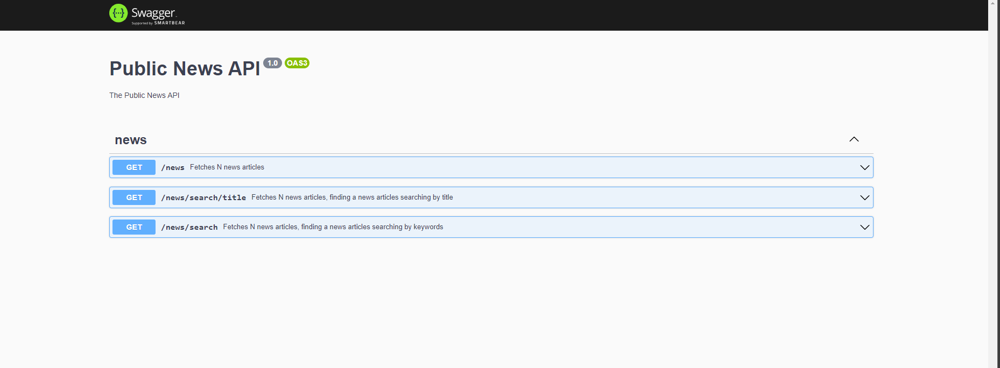

## Description
A sample API providing a wrapper on top of GNews application api


## API Documentation and Usage
The API documentation can be viewed in a browser by visiting the url `http://{host}:{port}/api-json` (https://localhost:3000/api-json) in a browser after the application has been started.
Please note that the port number may be different depending on the port number set in the environment variable `PORT` or the default port number `3000` if the environment variable is not set.



## Installation

```bash
$ npm install
$ npm run build

```


## Running the app

The application requires the news API key to successfully call the GNews api

The key can be set in the environment variable `NEWS_API_KEY` before starting the application

```bash
export NEWS_API_KEY="?????"
```

Alternatively, the key can be set in the .env file in the root directory of the project
```bash
NEWS_API_KEY=?????
```

```bash
# development
$ npm run start

# watch mode
$ npm run start:dev

# production mode
$ npm run start:prod
```

## Test

```bash
# unit tests
$ npm run test

# e2e tests
$ npm run test:e2e

# test coverage
$ npm run test:cov
```
